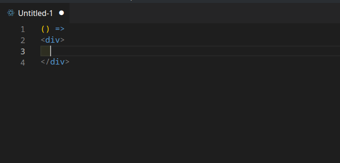

# rmcss README

Vscode extension that converts string className (React) to css modules format.

## Extension Settings

This extension contributes the following settings:

* `rmcss.className`: Name of the css object that holds the modular css classes.